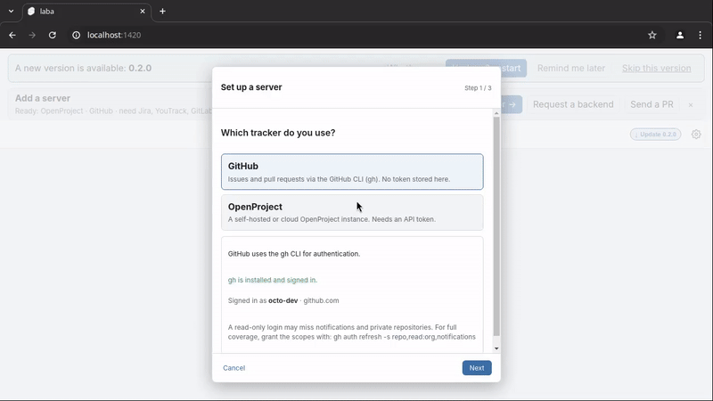
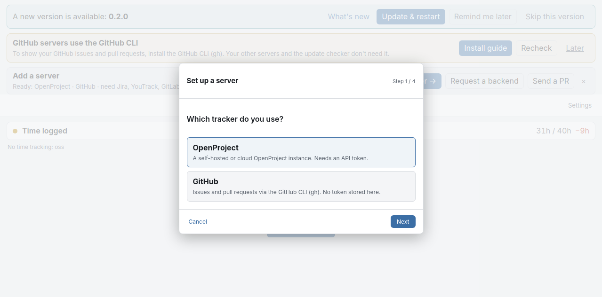
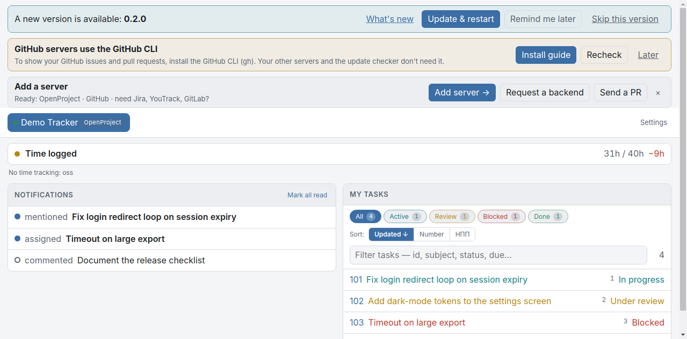
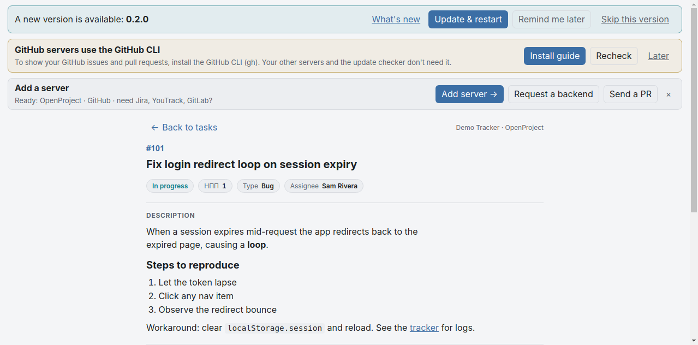
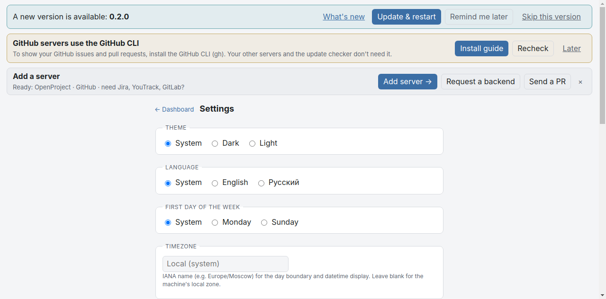

# laba

Desktop tray client and command-line interface for [OpenProject](https://www.openproject.org/),
built on [Tauri](https://tauri.app/) with a shared Rust core.

> Status: early work in progress. The design and implementation plan are being
> drafted; APIs and commands are not yet stable.

## Contents

- [Demo](#demo)
- [Goals](#goals)
- [Planned capabilities](#planned-capabilities)
- [Repository layout](#repository-layout)
- [Building](#building)
- [Testing](#testing)
- [Running](#running)
- [Environment variables](#environment-variables)
- [License](#license)

## Demo



The recording walks the first-run setup wizard and then the dashboard it fills
in. It runs against built-in mock data (anonymized), so no real server or account
is needed to preview the interface, and is reproducible with
`gui/scripts/record-demo.sh` (drives `vite dev` in headless Chrome under Xvfb and
captures it with ffmpeg).

|                                                          |                                                        |
| -------------------------------------------------------- | ------------------------------------------------------ |
|  |       |
|     |         |

## Goals

- A single Rust workspace providing:
  - a **core** library — OpenProject API v3 client (authentication, HAL
    normalization, credential storage, configuration);
  - a **CLI** binary for scripting and automation (JSON output by default);
  - a **desktop tray application** (Tauri) for Windows, macOS and Linux.
- The desktop application talks to the OpenProject API directly through the
  core library — it does not shell out to the CLI.

## Planned capabilities

- Work packages, comments, attachments, relations, time entries and
  notifications.
- Multiple OpenProject servers with a selectable default; per-server
  credentials and proxy settings (SOCKS5 / HTTP).
- Tray summaries for assigned work packages and logged time.

## Repository layout

| Path         | Crate / package  | Contents                                          |
|--------------|------------------|---------------------------------------------------|
| `core/`      | `laba-core`| OpenProject API client, config, cache, timelog    |
| `cli/`       | `laba-cli` | `laba` command-line binary                  |
| `gui/`       | —                | SvelteKit frontend                                |
| `gui/src-tauri/` | `laba-gui` | Tauri desktop shell (Rust)                     |

The Cargo workspace `default-members` are `core` and `cli`, so a plain
`cargo build` on the host skips the `gui` crate, which needs the webkit2gtk
system libraries. The GUI is built and tested only inside the Tauri container
(see below).

## Building

Prerequisites: a stable Rust toolchain (`rustup`), and for the GUI
[podman](https://podman.io/) (or Docker). No webkit/GTK development packages are
installed on the host — the GUI compiles inside a container image that bundles
them.

```sh
# Core + CLI (host):
cargo build --workspace --exclude laba-gui

# GUI (in the Tauri container): builds the frontend and the desktop bundle.
scripts/tauri-container.sh 'cd gui && npm ci && npm run tauri build'
```

## Testing

Rust tests run under [cargo-nextest](https://nexte.st/) (each test in its own
process). The GUI has a TypeScript/Svelte test suite plus a WebdriverIO smoke
test.

```sh
# Host: core + cli.
cargo nextest run --workspace --exclude laba-gui
cargo clippy --workspace --exclude laba-gui --all-targets -- -D warnings
cargo fmt --all --check

# GUI, in the container: lint, format, type-check, unit tests, Rust clippy.
scripts/tauri-container.sh 'cd gui && npm ci && npm run lint && npm run format:check && npm run check && npm test && cargo clippy -p laba-gui --all-targets -- -D warnings'
```

## Running

```sh
# CLI: log in to a server, then list your work packages.
cargo run -p laba-cli -- server add my-op https://op.example
cargo run -p laba-cli -- auth login --server my-op
cargo run -p laba-cli -- wp list

# GUI in development (hot reload), inside the container:
scripts/tauri-container.sh 'cd gui && npm ci && npm run tauri dev'
```

Run `cargo run -p laba-cli -- --help` for the full command list.

`scripts/gui-relaunch.sh` launches the GUI as a singleton (the newest launch
replaces any running instance) and is meant to be bound to a hotkey (Ctrl+Alt+P
in the author's setup) so pressing it after a rebuild runs the fresh binary. It
picks the binary as follows:

- when the local `use-debug-binary` marker file (in the repo root) is present,
  the freshly built debug binary (`target/debug/laba-gui`) runs — for
  development;
- otherwise the installed deb build (`/usr/bin/laba-gui`) runs — the normal,
  stable everyday build;
- if the deb is not installed, the debug binary runs regardless.

So the default (no marker) runs the stable deb. **Create the marker
(`touch use-debug-binary`) to develop against the debug build; delete it to go
back to the deb.**

`LABA_GUI_BIN` overrides the choice with an explicit path; `LABA_DEBUG_MARKER`
overrides the marker file location. `use-debug-binary` is gitignored (a local
toggle).

The GUI checks GitHub for a newer release once on launch and shows the result in
the header (checking / update available / up to date / check failed). Turn this
off in Settings → Updates; when off, no network call is made and the indicator
is hidden.

## Environment variables

CLI request options can be supplied via the environment (equivalent to the
corresponding global flags):

| Variable             | Equivalent flag | Purpose                                  |
|----------------------|-----------------|------------------------------------------|
| `OPENPROJECT_SERVER` | `--server`      | Select the active server profile         |
| `OPENPROJECT_TOKEN`  | `--token`       | API token override for this invocation   |
| `OPENPROJECT_PROXY`  | `--proxy`       | Proxy override (`none` disables it)      |
| `OPENPROJECT_RETRIES`| `--retries`     | Retry attempts for idempotent GETs       |

File locations follow the XDG base directories and can be overridden:

| Variable             | Overrides                              | Default                         |
|----------------------|----------------------------------------|---------------------------------|
| `OPENPROJECT_CACHE`  | Cache directory (user names, schemas)  | `$XDG_CACHE_HOME/laba`    |
| `OPENPROJECT_STATE`  | State file (last-seen history)         | `$XDG_STATE_HOME/laba`    |
| `OPENPROJECT_SECRETS`| Token file; when set, the system keyring is skipped and this file is the only store | `secrets.json` next to `config.json` |
| `XDG_CONFIG_HOME`    | Config directory (`config.json`, GUI settings) | `~/.config`             |

The GUI relaunch helper (`scripts/gui-relaunch.sh`) reads two more:

| Variable            | Overrides                                      | Default                   |
|---------------------|------------------------------------------------|---------------------------|
| `LABA_GUI_BIN`      | Binary to launch (explicit path wins over all) | chosen by the marker file |
| `LABA_DEBUG_MARKER` | Marker file location (present → debug build)   | `<repo>/use-debug-binary` |

Logging verbosity is controlled independently:

| Variable   | Purpose                                                          | Default                                  |
|------------|-----------------------------------------------------------------|------------------------------------------|
| `RUST_LOG` | Log level (`error`/`warn`/`info`/`debug`/`trace`); records go to stderr | CLI: `warn` (raised by `-v`/`-vv`); GUI: `info` |

## License

MIT. See [LICENSE](LICENSE).

Third-party crate licenses are listed in
[THIRD-PARTY-LICENSES.md](THIRD-PARTY-LICENSES.md) (regenerate with
`scripts/gen-third-party-licenses.sh`).
